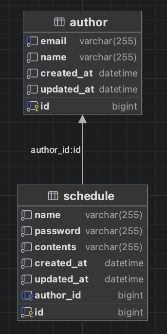

# 📘 Schedule API 명세서

## ✅ 전체 일정 조회

| 기능           | Method  | URL        | request                                                         | response                                                                                                                                       | 상태코드 |
|--------------|---------|------------|-----------------------------------------------------------------|------------------------------------------------------------------------------------------------------------------------------------------------|------|
| **일정등록**     | `POST`  | /schedules | {"name": "제목","password": "비밀번호","contents": "내용",}             | { "id": 1, "name": "제목", "password": "비밀번호", "contents": "내용", "createdAt": "2025-05-12T18:43:36", "updatedAt": "2025-05-12T18:43:36"  }       | 201 Created
| **일정 전체 조회** | `GET`   | /schedules |                                                                 | { "id": 1, "name": "제목", "password": "비밀번호", "contents": "내용", "createdAt": "2025-05-12T18:43:36", "updatedAt": "2025-05-12T18:43:36"  }       | 200 OK
| **일정 단건 조회** | `GET`   | /schedules/{id} |                                                                 | { "id": 1, "name": "제목", "password": "비밀번호", "contents": "내용", "createdAt": "2025-05-12T18:43:36", "updatedAt": "2025-05-12T18:43:36"  }       | 200 OK
| **일정 수정**    | `PATCH` | /schedules/{id} | { "name" : "수정 제목", "contents" : "수정 내용", "password" : "비밀번호" } | { "id": 1, "name": "수정 제목", "password": "비밀번호", "contents": "수정 내용", "createdAt": "2025-05-12T18:43:36", "updatedAt": "2025-06-12T09:43:36"  } | 200 OK
| **일정 삭제**    | `DELETE` |/schedules/{id} | { "password" : "1234" } |  | 200 OK

# 📘 ERD

